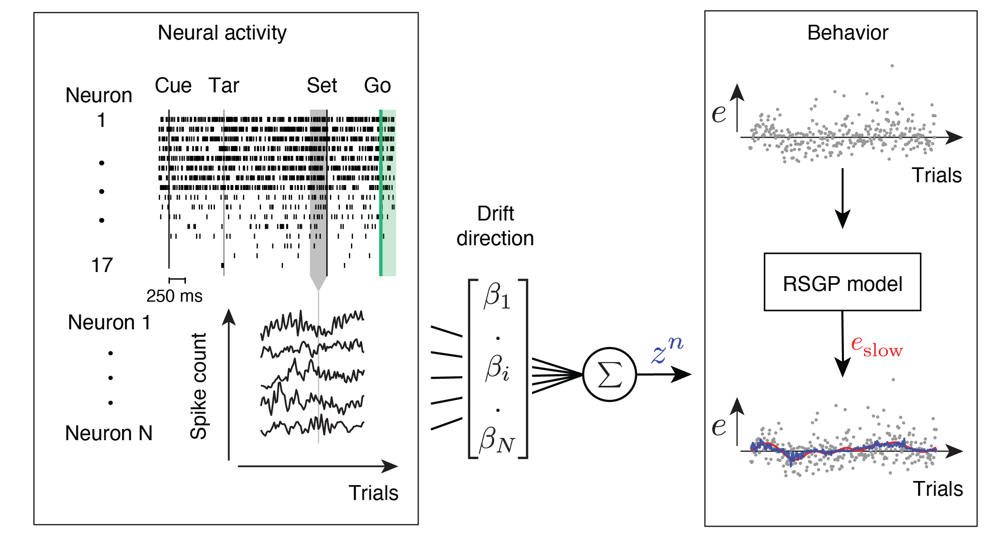
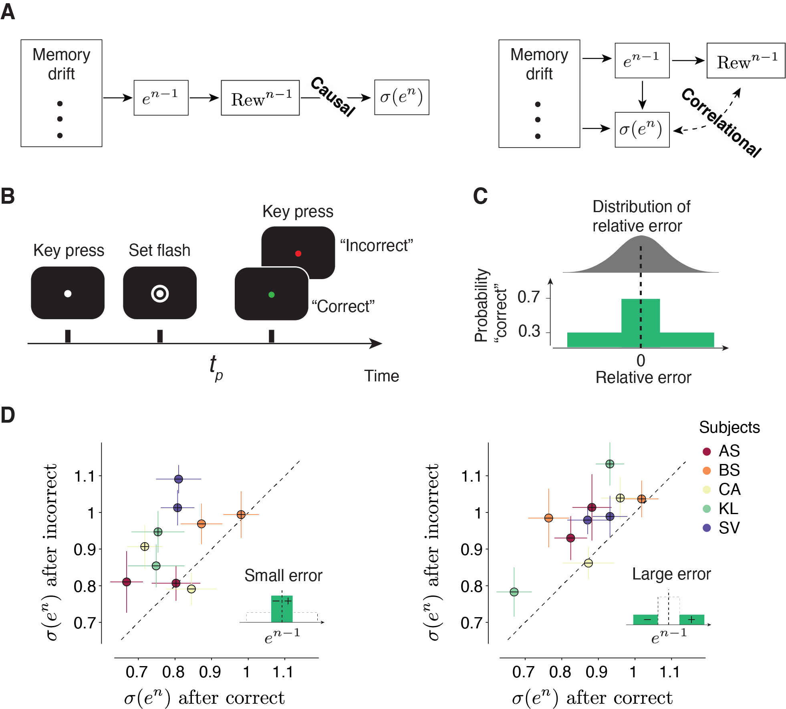

  

## For Figure 6 in "Reinforcement regulates timing variability in thalamus"

  ### Main
      Simulator.m 
  ### Modules for each model
      RSGPsimulator.m
      DSsimulator.m
      MCMCsimulator.m
  ###  See [RSGP](https://github.com/wangjing0/RSGP) for fitting time series data to RSGP model
  
  ### Causal control experiment
  

  

